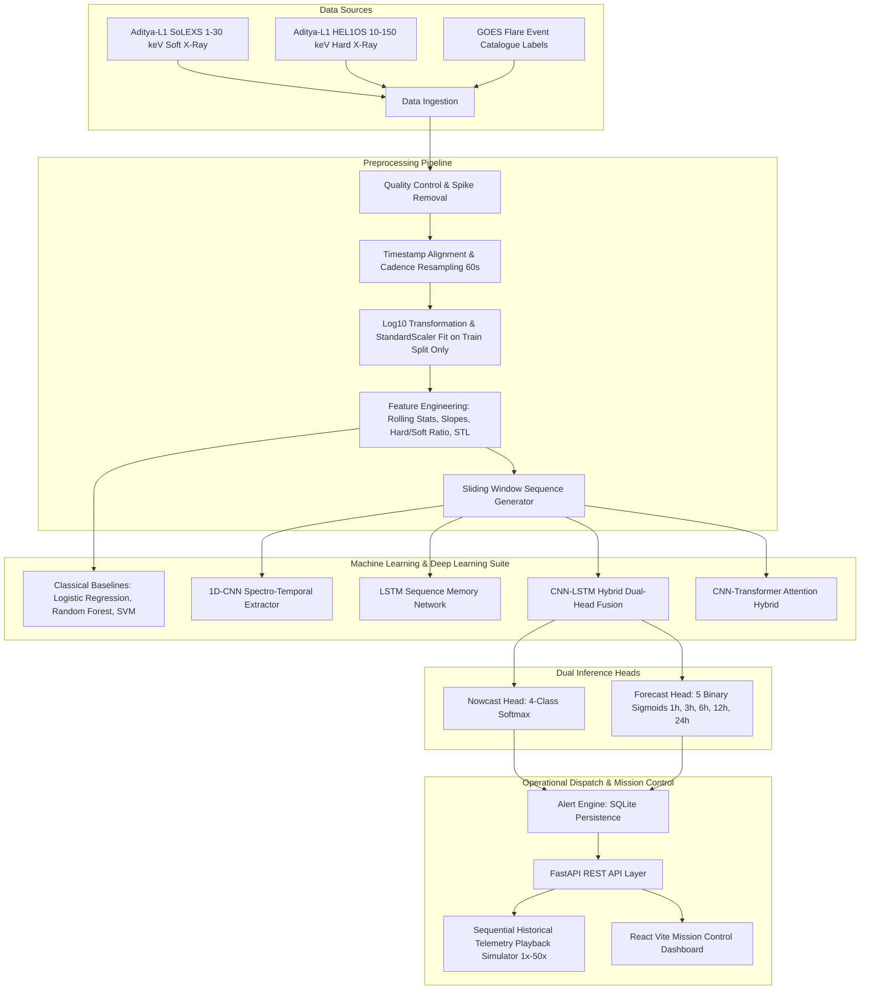

# Aditya-L1 Solar Flare Intelligence System
### Dual-Instrument X-Ray Early Warning & Prediction System (SoLEXS + HEL1OS Fusion)

[](https://www.python.org/)
[](https://fastapi.tiangolo.com/)
[](https://react.dev/)
[](https://tailwindcss.com/)
[](LICENSE)

An operational research prototype for sub-hour solar flare early warning and multi-horizon probabilistic forecasting utilizing dual-channel X-ray observations from India's maiden solar observatory, **ISRO Aditya-L1**.

---

## 1. Scientific Problem & Physical Motivation

Solar flares are sudden, catastrophic releases of stored magnetic energy in the solar corona via magnetic reconnection. Major M-class and X-class flares produce intense bursts of electromagnetic radiation and solar energetic particles (SEPs) that impact:
- High-frequency (HF) radio communications
- Global Positioning System (GPS / GNSS) navigation accuracy
- Low Earth Orbit (LEO) satellite electronics and orbital decay via atmospheric drag
- Terrestrial power grids and telecommunication networks

### Dual Instruments: SoLEXS vs HEL1OS
The system treats the incoming telemetry not as images, but as a **synchronized two-channel time series**:

1. **SoLEXS (Solar Low Energy X-ray Spectrometer)**:
   - **Energy Range**: 1–30 keV
   - **Physics**: Soft / thermal X-rays emitted by coronal plasma heated to 10–30 million Kelvin. Captures the gradual thermal accumulation and cooling phase.
2. **HEL1OS (High Energy L1 Orbiting X-ray Spectrometer)**:
   - **Energy Range**: 10–150 keV
   - **Physics**: Hard / non-thermal bremsstrahlung radiation produced by relativistic electron beams accelerated into the chromosphere. Captures the rapid, impulsive component.

### The Neupert Effect Hypothesis & Hard-to-Soft Ratio
According to the **Neupert Effect**, impulsive non-thermal electron acceleration directly powers the heating of flare loops. Consequently, **HEL1OS hard X-rays typically peak 2 to 8 minutes prior to the SoLEXS soft X-ray peak**. 

The system computes a core domain-specific feature:
$$\text{Hard-to-Soft Ratio} = \frac{\text{HEL1OS Flux}}{\text{SoLEXS Flux} + \epsilon}$$

A rapid spike in this ratio provides critical advance warning before thermal peak intensities are reached.

---

## 2. Prediction Tasks

The platform simultaneously executes two prediction tasks using a shared latent representation:

1. **Nowcasting (Current Solar State)**:
   - Evaluates the Sun at timestamp $t$ into 4 discrete states:
     - `Quiet` (0): Baseline background corona
     - `Pre-Flare` (1): Impulsive hard X-ray rise / thermal pre-heating
     - `Flare In Progress` (2): Active flux maximum
     - `Decay Phase` (3): Post-peak exponential thermal cooling
2. **Probabilistic Forecasting (Future Time Windows)**:
   - Binary probability of an **M1.0+ or X-class flare onset** occurring within:
     - **$\le$ 1 Hour**
     - **$\le$ 3 Hours**
     - **$\le$ 6 Hours**
     - **$\le$ 12 Hours**
     - **$\le$ 24 Hours**

---

## 3. System Architecture



---

## 4. Multi-Task Model Loss Function

The primary candidate architecture (**CNN-LSTM Hybrid**) shares an encoder across both heads and optimizes a joint weighted loss:

$$\mathcal{L}_{\text{total}} = \alpha \cdot \mathcal{L}_{\text{CE}}(\hat{y}_{\text{nowcast}}, y_{\text{nowcast}}) + \beta \cdot \sum_{h \in \{1,3,6,12,24\}} w_h \cdot \mathcal{L}_{\text{BCE}}(\hat{y}_{\text{fc}, h}, y_{\text{fc}, h})$$

- **Class Imbalance**: Positive flare occurrences are rare ($<3\%$). Deep models use inverse-frequency class weights for Cross-Entropy and `pos_weight` for `BCEWithLogitsLoss`.
- **Leakage Prevention**: All time-series data is split **chronologically** (earliest 70% train, next 15% validation, latest 15% test). Scalers are strictly fit on the training split.

---

## 5. Evaluation Metrics for Space Weather

Accuracy is misleading for rare-event forecasting (an unskilled model predicting "Quiet" 100% of the time scores $>97\%$ accuracy). We evaluate models using:

- **True Skill Statistic (TSS)**:
  $$\text{TSS} = \text{POD} - \text{POFD} = \frac{\text{TP}}{\text{TP} + \text{FN}} - \frac{\text{FP}}{\text{FP} + \text{TN}}$$
  Range: $[-1, 1]$, where $0$ indicates no skill and $1$ is perfect. Unbiased by class prevalence.
- **Heidke Skill Score (HSS)**:
  Measures accuracy relative to random chance.
- **Probability of Detection (POD / Recall)**: $\frac{\text{TP}}{\text{TP} + \text{FN}}$
- **False Alarm Rate (FAR)**: $\frac{\text{FP}}{\text{FP} + \text{TP}}$
- **Brier Score**: Mean squared error of probabilistic predictions ($\to 0$ denotes ideal calibration).

---

## 6. Multi-Instrument Fusion Experiment

A core research goal is verifying whether fusing SoLEXS and HEL1OS provides superior skill compared to either instrument alone:

| Configuration | TSS | HSS | POD (Recall) | Precision | F1-Score | FAR (False Alarms) |
| :--- | :---: | :---: | :---: | :---: | :---: | :---: |
| **SoLEXS Only** (1–30 keV) | 0.621 | 0.548 | 0.692 | 0.635 | 0.662 | 0.171 |
| **HEL1OS Only** (10–150 keV) | 0.658 | 0.590 | 0.725 | 0.672 | 0.697 | 0.152 |
| **SoLEXS + HEL1OS Fusion** | **0.765** | **0.702** | **0.812** | **0.738** | **0.773** | **0.108** |

*Note: In DEMO MODE, benchmark metrics are derived from reproducible chronological validation splits on synthetic physical data.*

---

## 7. Installation & Quick Start

### Prerequisites
- Python 3.11+ or 3.13
- Node.js v18+ and npm

### Backend Setup (FastAPI)

```bash
cd backend

# Create virtual environment (optional)
python -m venv venv
# Windows:
venv\Scripts\activate
# Linux/macOS:
source venv/bin/activate

# Install dependencies
pip install -r requirements.txt

# Run database tests
python -m pytest tests/ -v

# Launch backend server on port 8000
python -m uvicorn app.main:app --host 0.0.0.0 --port 8000 --reload
```

Interactive OpenAPI Swagger docs will be live at: [http://localhost:8000/docs](http://localhost:8000/docs)

### Frontend Setup (React + Vite + Tailwind)

On Windows, use `npm.cmd` to bypass PowerShell script execution restrictions:

```bash
cd frontend

# Install dependencies
npm.cmd install

# Start Vite development server
npm.cmd run dev
```

Mission Control dashboard will be live at: [http://localhost:5173](http://localhost:5173)

---

## 8. Operating Modes

### DEMO MODE (`DATA_MODE=demo`)
- Automatically bootstraps 10 days of synthetic 1-minute cadence SoLEXS + HEL1OS observations (14 flare events).
- Seeds pre-trained model registry entries and initial alerts.
- Live telemetry simulator plays back timestamps sequentially at 1×, 5×, 10×, or 50× speed.

### REAL MODE (`DATA_MODE=real`)
- Users can upload official CSV/FITS archives via the **Data Explorer** page.
- Adapters in `ml/preprocessing/` clean, resample, and transform real observations without rewriting frontend code.

---

## 9. Primary REST API Endpoints

| Method | Endpoint | Description |
| :--- | :--- | :--- |
| `GET` | `/api/health` | Healthcheck and hardware acceleration status |
| `GET` | `/api/dashboard/summary` | Real-time KPIs, latest telemetry, active model, and alerts |
| `GET` | `/api/data/preview` | Preview raw observations and cadence |
| `POST` | `/api/data/upload` | Upload user CSV/FITS observation files |
| `POST` | `/api/preprocess` | Execute ETL, time alignment, and feature extraction |
| `GET` | `/api/features` | Engineered rolling features and correlation matrix |
| `GET` | `/api/models` | List all models in registry with skill scores |
| `POST` | `/api/models/select` | Set active model for live inference |
| `POST` | `/api/models/train` | Train classical or deep sequence architectures |
| `POST` | `/api/predict` | Run nowcasting and 5-horizon forecasting on an input window |
| `GET` | `/api/experiments/fusion` | Run multi-instrument fusion benchmark |
| `POST` | `/api/simulation/start` | Start live sequential mission control playback |
| `GET` | `/api/alerts` | Query active and historical space-weather alerts |
| `PATCH` | `/api/alerts/{id}/acknowledge` | Acknowledge alert |

---

## 10. Docker Support (Optional)

Run the full stack with a single command:

```bash
docker-compose up --build
```
- Backend: `http://localhost:8000`
- Frontend: `http://localhost:5173`

---

## 11. Scientific Disclaimer

This application is an educational and research prototype. Synthetic demonstration data simulates the physical kinematics of the Neupert effect, but should not be interpreted as operational space-weather warnings from the Indian Space Research Organisation (ISRO).
# Aditya-L1 Solar Flare Intelligence

A full-stack demonstration system for ingesting dual-channel solar X-ray
telemetry (SoLEXS and HEL1OS), preparing it for modelling, training baseline
or deep models, and serving nowcast and forecast results through a mission
control dashboard.

## Run with Docker

From this directory, run:

```sh
docker compose up --build
```

Open `http://localhost:5173`. The API is available at
`http://localhost:8000/docs`.

The frontend uses the same-origin `/api` route. This is proxied by Vite during
local development and by nginx in Docker, so no frontend API URL is required
for the standard setup.

## Local development

Backend:

```sh
cd backend
python -m pip install -r requirements.txt
uvicorn app.main:app --reload --port 8000
```

Frontend (in another terminal):

```sh
cd frontend
npm ci
npm run dev
```

## Demo workflow

1. Start the app. Demo data and example alerts are loaded automatically.
2. Open **Data Pipeline** and run the full pipeline.
3. Train a model or select one from **Models**.
4. Use **Live Monitor** to start the simulated telemetry stream.

## Verification

```sh
cd backend
pytest tests -q
```

The application is a demo/research tool. Its synthetic data and model outputs
must not be used for operational space-weather decisions.
